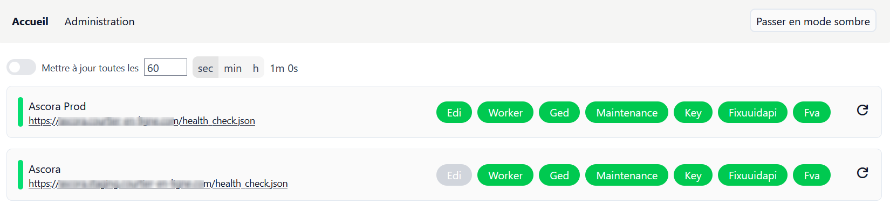

# CEL3 Healthchecker

Interface d'administration et de suivi dédiée au services du CEL3 (Custy / ADHOC)



Cette interface a été développée dans le but de simplifier le suivi du statut des différents CEL qui n'était pas suffisamment détaillé avec l'utilisation d'[Uptime Kuma](https://github.com/louislam/uptime-kuma).

# Structure du projet

La majorité des parties non utilisées de Rails ont été supprimées. Tout le reste est une app Rails classique sauf la partie front / views qui a été supprimée car gérée par React et qui se situe dans `app/javascript/components` et `app/javascript/pages`.

Pour en savoir plus voir la documentation d'[Inertia Rails](https://inertia-rails.dev/)

# Interface d'administration

L'écran d'administration est protégé par une authentification HTTP (popup sur le navigateur). Pour définir les identifiants il faut définir des identifiants dans le fichier credentials de rails.

Ce fichier peut être ajouté sur Git car protégé par un fichier `master.key`. Ce fichier sera ajouté sur Lockself ainsi que les identifiants qui ont été définis par défaut.

Pour plus d'info : https://guides.rubyonrails.org/security.html#custom-credentials

```yml
admin_auth:
  username: admin
  password: admin_password
```

# Développement

- Ruby 3.3.5
- Rails 8.0.2
- React 19
- Inertia Rails 3.7
- NodeJS 22.14

Pour pouvoir lancer le projet, il faut installer les dépendances Ruby (bundler) et Node (npm).

```shell
npm install && bundle install
```

Il faut ensuite avoir une des gem suivantes pour pouvoir lancer le dev server.

`apt-get install tmux && gem install overmind` (recommandé) ou `gem install hivemind` ou `gem install foreman`

Une fois au moins une des gem ci-dessus installées lancer le dev server avec la commande `bin/dev` (depuis la racine du projet). Cela va lancer le serveur vite et le serveur Rails pour les rebuild automatiques à chaque changement.

L'app est accessible depuis `localhost:3100`.

# Test

Seuls quelques tests basiques ont été mis en place et un stub de requête http est utilisé pour valider le retour des API `health_check.json` du CEL3.

Pour lancer les tests (Minitest) :

```shell
rails test
```

# Déploiement

Aucun déploiement en production n'a été fait pour le moment mais il est possible de déployer avec Kamal qui est déjà une dépendance du projet. Cela permet d'automatiser le déploiement avec Github / Gitlab en utilisant docker.
